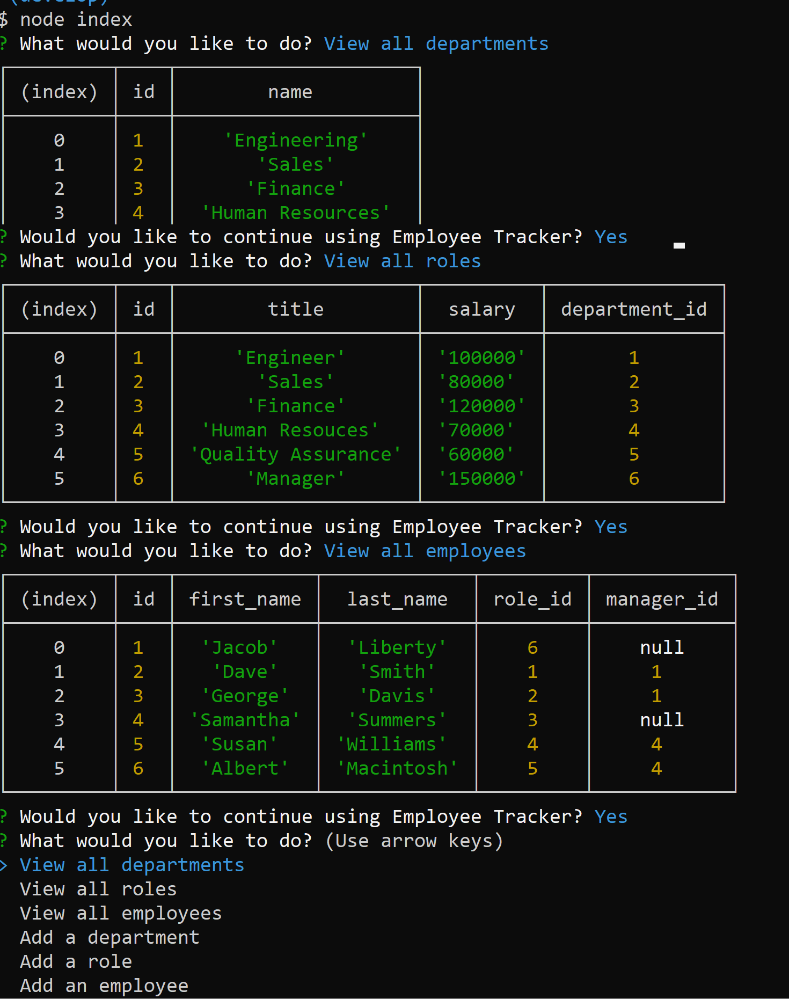

  # Employee Tracker

  ## Table of Contents:

  ---
  * [Description](#description)
  * [Installation](#installation)  
  * [Usage](#usage)  
  * [Credits](#credits)    
  * [Tests](#tests)  
  * [Questions](#questions)  

  ## Description

  ---
  This project is a program built to track Employee's and managers with their respective roles and departments. It could be used to keep an updated file of a company including salaries, roles, and all employees.

  ## Installation:

  ---
  To install all necessary dependencies for this program,
  open the console and run the following command:  
  ```npm i ```

  ## Usages

  ---
  This project is used for creating Employees upon hire with their given role, title, and salary etc. and that employee can now be kept track of and updated depending on promotions or if they are let go.

  
  
  ## Credits

  ---
  There are no additional people who have contributed to this project.

  ### Third Party Assets:
  - Node.js
  - mySQL
  - Inquire
  - Express  
  - Console Table


  ## Tests

  ---
  To test/use this application run this command in the console:  
  ```node index```

  ## Questions

  ---
  For any questions feel free to reach out through the following contacts:  

  Email: jacob.tobin.liberty@gmail.com
  Github: https://github.com/JacobGit3  
  